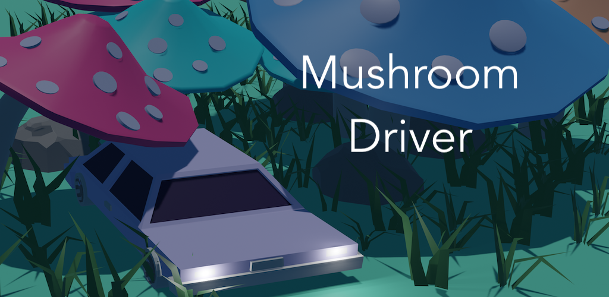
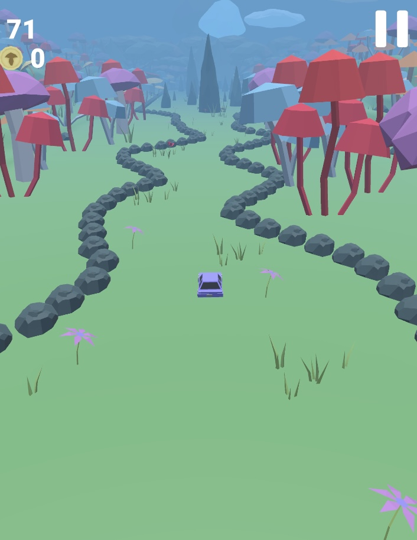
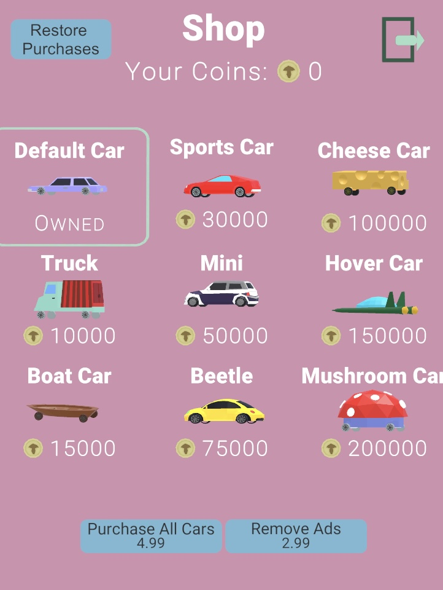
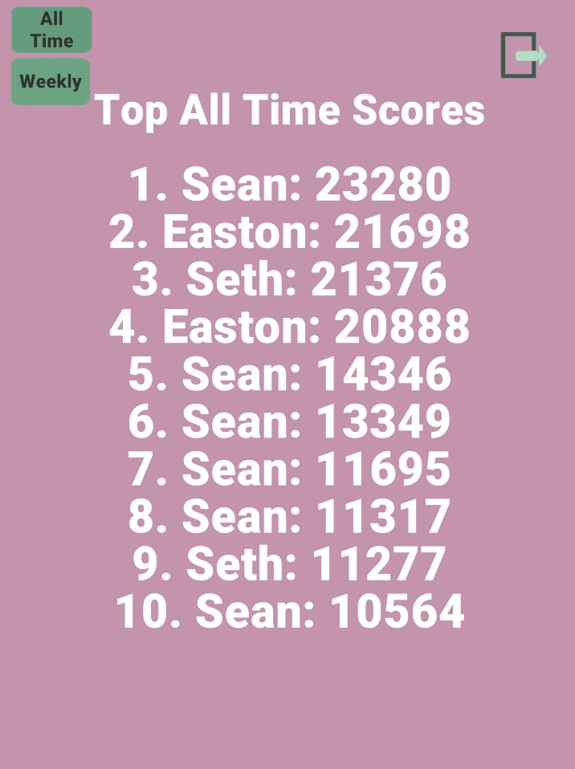

[App Store](https://apps.apple.com/us/app/mushroom-driver/id1635598791) | [Google Play Store](https://play.google.com/store/apps/details?id=com.GooninGames.MushroomDriver)

<h1 style='text-align: center;font-size: 3rem;'>Mushroom Driver</h1>

Mushroom Driver is a mobile game I created during the summer of 2022. I created it using the [Unity Engine](https://unity.com/), which uses C# as its scripting language. 

#### The Game

Mushroom Driver is an infinite runner style game where the player can take control of one of many cars and drive through the land of mushrooms. As the player drives they must dodge and weave between the rocks and mushrooms in their way all while their car gets faster and faster. 

#### Leaderboards

Mushroom Driver uses [LootLocker](https://lootlocker.com/) to host both all-time and weekly leaderboards. After a player reaches a score that places top 10 in one or both boards the player will have to input the name they want displayed and then Mushroom Driver will upload the score and that name to the loot locker database. Now every fetch for the top scores will return that new name and score in the proper spot. 

#### Ads and In-App-Purchases

I implemented advertisements and in-app-purchases to get some income and pay off the fees of the two App Stores the game is on. The advertisement service I used is [Unity Ads](https://unity.com/solutions/unity-ads). I used [Apple's](https://developer.apple.com/documentation/storekit/in-app_purchase) and  [Google Play's](https://developer.android.com/google/play/billing) IAP services for their respective app stores. I used each service's API in order to properly integrate their service into the game.  
